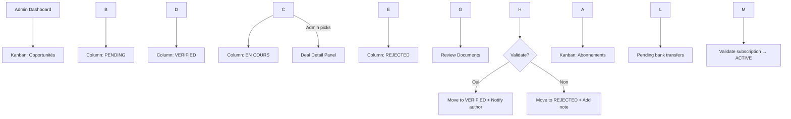

\---

stepsCompleted:

* step-01-init
* step-02-discovery
* step-03-core-experience
* step-04-emotional-response
* step-05-inspiration
* step-06-design-system
* step-07-defining-experience
* step-08-visual-foundation
* step-09-design-directions
* step-10-user-journeys
* step-11-component-strategy
* step-12-ux-patterns
* step-13-responsive-accessibility
* step-14-complete
inputDocuments:
* product-brief.md
* prd.md
* prisma/schema.prisma
* src/lib/auth.config.ts
* src/lib/auth.ts
lastStep: 14
workflowType: ux-design

\---

# UX Design Specification — IBC (Ivoire Business Club)

**Author:** Alphaperseii  
**Date:** 2026-05-12  
**Version:** 1.0  
**Status:** Complete  
**Language:** English (product UI in French)  
**Platform:** Web (Next.js 16 App Router, TailwindCSS 4, shadcn/ui)  
**Primary Device:** Mobile-first (smartphones in West Africa \& Europe)

\---

## Table of Contents

1. Executive Summary
2. Core User Experience
3. Desired Emotional Response
4. UX Pattern Analysis \& Inspiration
5. Design System Foundation
6. Defining Core Experience
7. Visual Design Foundation
8. Design Direction Decision
9. User Journey Flows
10. Page Layouts
11. Component Strategy
12. UX Consistency Patterns
13. Responsive Design \& Accessibility
14. Interaction States
15. Implementation Notes

\---

## 1\. Executive Summary

### 1.1 Project Vision

IBC is the first **informational trust operator** for Ivorian diaspora investors in Europe. It does not sell opportunities — it sells **perceived risk reduction at a distance**.

The UX must embody trust, simplicity, and cultural fluency. Every screen should make the user feel safer, more informed, and more connected to verified investment opportunities in Côte d'Ivoire.

### 1.2 Target Users

* **Sarah — Novice Diaspora Investor** (primary): Infirmière in Paris, 20–40 k€ to invest, needs hand-holding, absolute trust, and step-by-step guidance. Uses smartphone exclusively. Not tech-savvy.
* **Jean — Advanced Investor** (secondary): Entrepreneur in Switzerland, large capital, wants priority access and exclusive deals. Uses laptop + phone.
* **Koffi — Local Project Owner** (tertiary): Promoteur immobilier in Abidjan, needs credibility and diaspora visibility. Uses smartphone primarily.
* **Awa — Consultant/Partner Seeker** (quaternary): French-based cadre, needs targeted matching without broadcast noise.

### 1.3 Key Design Challenges

1. **Trust at a distance** — Users must feel confident investing 6,000 km away without ever visiting the site.
2. **Fracture numérique** — A significant portion of the target audience is not tech-savvy; the UI must be dead-simple.
3. **Bank-transfer payment friction** — No instant Stripe/CinetPay gratification; users pay by wire and wait for manual admin validation. The UX must make this feel secure, not broken.
4. **WhatsApp-native culture** — The app must feel like a natural extension of how Ivorians already communicate (WhatsApp deep links everywhere).
5. **Tiered access clarity** — Three membership tiers with different deal visibility; users must instantly understand what they get and why they should upgrade.

### 1.4 Design Opportunities

1. **Trust Infrastructure as UX moat** — Verification badges (bronze/argent/or), legal document previews, and post-deal reviews create a visual language of safety competitors cannot copy.
2. **Teaser-to-conversion loop** — Public deal teasers (title + location only) drive SEO and organic discovery without a hard paywall.
3. **WhatsApp-first contact** — Every profile and deal has a prominent "Discuter sur WhatsApp" CTA, leveraging the platform users already trust.
4. **Kanban transparency for admins** — A clean admin verification board makes the back-office team efficient and the process visible.

\---

## 2\. Core User Experience

### 2.1 Defining Experience

The ONE thing users do most frequently: **discover and evaluate verified investment deals**, then initiate contact via WhatsApp.

The core loop:

1. User opens app (or lands on page)
2. Browses deals filtered by tier + category
3. Taps a deal to see verification level, legal docs, and promoter profile
4. Taps "Contacter sur WhatsApp" to open a `wa.me` deep link
5. Negotiates and invests outside the platform

### 2.2 Platform Strategy

* **Primary:** Mobile web (PWA-ready) — 80%+ of traffic
* **Secondary:** Desktop web — for admin dashboard and advanced investors doing due diligence
* **Touch-first** — All CTAs, cards, and navigation must work with thumbs on 5"–6.7" screens
* **No native app for Phase 1** — Responsive web only; PWA future

### 2.3 Effortless Interactions

* **One-tap WhatsApp contact** — No copy-pasting phone numbers. The `wa.me` link opens WhatsApp directly (mobile) or WhatsApp Web (desktop).
* **Instant deal preview** — Deal cards on the feed show trust badge + teaser info without loading a new page.
* **Google OAuth one-tap signup** — No form filling for the primary user segment.
* **Auto-detected tier assignment** — New users start as AFFRANCHI automatically; upgrade is explicit.
* **Bank transfer instructions copy-to-clipboard** — RIB, amount, and reference pre-filled for easy pasting into banking apps.

### 2.4 Critical Success Moments

1. **First deal viewed** — User sees a verified deal with bronze/argent/or badge and attached legal docs. "This looks real."
2. **First WhatsApp contact** — Deep link works flawlessly. "That was easy."
3. **Subscription activation email** — Admin validates the wire; user receives confirmation. "I'm now inside the club."
4. **Admin verifies a deal** — Kanban card moves to VERIFIED; promoter gets notified. "The system works."

### 2.5 Experience Principles

1. **Trust before content** — Every screen must visually reinforce safety (badges, verification status, legal doc icons) before showing opportunity details.
2. **Mobile thumb zone** — Primary actions (WhatsApp CTA, primary buttons) sit in the bottom 25% of the viewport. Secondary actions (filters, search) at the top.
3. **Zero dead-ends** — Empty states, error states, and pending states always offer a next step (e.g., "Aucun deal vérifié pour le moment — voir les deals en attente" or "Votre abonnement est en cours de validation — contacter le support").
4. **French-first, jargon-free** — All labels in plain French. No English UI terms. No financial jargon without tooltips.
5. **WhatsApp is the exit** — The platform's job is to qualify and match; the conversation happens on WhatsApp. The hand-off must feel seamless.

\---

## 3\. Desired Emotional Response

### 3.1 Primary Emotional Goals

* **Confiance (Trust)** — The dominant emotion. Users must feel the platform is safer than a random WhatsApp group.
* **Contrôle (Control)** — Users choose their tier, their deals, their contacts. No algorithmic black box.
* **Fierté (Pride)** — Being a "Boss" or "Grand Frère" member carries social status within the diaspora community.

### 3.2 Emotional Journey Mapping

|Stage|Desired Emotion|UX Support|
|-|-|-|
|**Discovery** (landing page)|Curiosity + Safety|Teaser deals, "Mur des succès" social proof, clear tier pricing|
|**Onboarding** (signup + tier choice)|Excitement + Clarity|3-click guided flow, tier comparison cards, transparent pricing|
|**Payment** (bank transfer instructions)|Security + Patience|Professional RIB display, copy buttons, "Nous validons sous 24h" reassurance|
|**Waiting for activation**|Anticipation (not anxiety)|Status tracker (TRIAL → en attente de validation → ACTIVE), support contact|
|**First deal view**|Trust + Opportunity|Verification badges, legal doc previews, promoter KYC summary|
|**Contact via WhatsApp**|Confidence|Prominent green WhatsApp button, pre-filled message suggestion|
|**Post-deal review**|Accomplishment + Belonging|Review form with star ratings, "Membre Platinum" badge unlock animation|
|**Error / Rejection**|Reassurance|Human support WhatsApp link, clear explanation, actionable next step|

### 3.3 Micro-Emotions

* **Confidence vs. Confusion** — Trust badges and clear labels win over sophisticated UI. Prefer explicit over implicit.
* **Trust vs. Skepticism** — Every deal page must show WHO verified it (admin name or IBC logo), WHEN, and WHAT was checked.
* **Excitement vs. Anxiety** — Large investment amounts (>50 k€) trigger double-verification UI with extra visual reassurance (gold badge, extra doc row).
* **Belonging vs. Isolation** — Tier names (Affranchis, Grands Frères, Boss) are culturally resonant. Use them consistently in headings, CTAs, and emails.

### 3.4 Design Implications

* **Confiance** → High-contrast verification badges, document upload icons, admin avatar + name on verified deals.
* **Contrôle** → Clear tier comparison table before payment, easy tier switch in profile settings.
* **Fierté** → Tier badge on profile card, "Membre depuis \[date]", platinum badge animation on unlock.

\---

## 4\. UX Pattern Analysis \& Inspiration

### 4.1 Inspiring Products

1. **Airbnb (Trust \& Discovery)** — Verified host badges, review system, teaser photos before booking. IBC adapts: verification badges for deals, post-deal reviews, teaser listings.
2. **LinkedIn (Professional Networking)** — Profile credibility signals, connection requests. IBC adapts: member profiles with tier badges, WhatsApp contact instead of InMail.
3. **Substack (Tiered Content)** — Free preview → paid subscription. IBC adapts: public deal teasers → paid tier unlocks full dossier + WhatsApp contact.
4. **WhatsApp Business (Native Communication)** — Deep links, business profiles. IBC adapts: `wa.me` links on every profile/deal as the primary CTA.

### 4.2 Transferable UX Patterns

**Navigation Patterns:**

* **Bottom tab bar** (mobile) — 3–4 tabs max: Deals, Matching, Profile, (Admin if applicable)
* **Card-based feed** — Vertical scroll of deal cards, each card is self-contained (image, title, location, amount, trust badge)
* **Filter chips** — Horizontal scroll of category + tier chips above the feed

**Interaction Patterns:**

* **Swipe-to-dismiss** for notification modals (optional, Phase 2)
* **Pull-to-refresh** on deal feeds
* **Long-press preview** on deal cards to peek at verification status (optional)
* **Sticky CTA bar** at bottom of deal detail pages: WhatsApp contact + soft-commit "Intéressé"

**Visual Patterns:**

* **Trust color coding** — Bronze (warm brown), Argent (cool gray), Or (amber/gold)
* **Status pills** — PENDING (yellow), VERIFIED (green), REJECTED (red), used consistently across deals and subscriptions
* **Document attachment row** — Paperclip icon + document name + preview thumbnail

### 4.3 Anti-Patterns to Avoid

* **No infinite scroll without filters** — Diaspora investors need targeted deals, not an endless unqualified list. Always show active filters.
* **No dark-pattern upgrade nudging** — Tier upgrades must be transparent and optional. No blocking core functionality to force payment.
* **No in-app messaging** — Do not try to replace WhatsApp. Users trust WhatsApp; an in-app chat feels alien and less secure.
* **No complex dashboards for members** — The member dashboard should show deals, profile, and subscription status only. Admin gets the complex kanban.
* **No auto-play media** — Respect mobile data costs in West Africa. All media loads on user tap.

### 4.4 Design Inspiration Strategy

* **Adopt** from Airbnb: trust badge system, review star ratings, host/deal verification flow
* **Adapt** from LinkedIn: profile credibility → IBC verification tier + post-deal reputation
* **Adopt** from Substack: teaser-to-paywall content gating → deal teaser tier gating
* **Adopt** from WhatsApp: deep link as primary CTA pattern, green brand color association for "contact"
* **Avoid** complex marketplace UI patterns (eBay, Amazon) — too much noise for a trust-first product

\---

## 5\. Design System Foundation

### 5.1 Design System Choice

**shadcn/ui + TailwindCSS 4** — Themeable, headless component primitives with full styling control.

**Rationale:**

* The project already uses TailwindCSS 4 and Next.js 16; shadcn/ui is the native component ecosystem.
* Provides accessible, unstyled primitives that can be fully customized for IBC's trust-first visual identity.
* No runtime dependency bloat — components are copied into the codebase.
* Supports the CN (class name) utility pattern already common in the project.

### 5.2 Implementation Approach

* Use `shadcn/ui` base components: Button, Card, Dialog, Input, Select, Tabs, Badge, Avatar, Skeleton, Toast
* Build **custom IBC components** on top: TrustBadge, DealCard, WhatsAppCTA, TierCard, VerificationTimeline, DocumentRow, StatusPill
* Theme via `globals.css` CSS variables for colors, spacing, and typography tokens
* Dark mode support via Tailwind `dark:` variants (NFR-A2)

### 5.3 Customization Strategy

* Override shadcn default radius (use `0.75rem` for a friendly, approachable feel)
* Replace default blue primary with IBC brand colors (see §7 Visual Design Foundation)
* Add custom animations: badge unlock pulse, status transition fade, toast slide-up
* Extend Tailwind config with IBC-specific spacing scale (base 4px, mobile-first touch targets)

\---

## 6\. Defining Core Experience

### 6.1 Defining Experience

> "Découvrir des opportunités vérifiées et contacter immédiatement le porteur de projet sur WhatsApp."

This is the "swipe right" of IBC. If a user can find a relevant deal, verify its legitimacy at a glance, and start a WhatsApp conversation in under 60 seconds, the product succeeds.

### 6.2 User Mental Model

Users currently solve this problem by:

* Scrolling through noisy WhatsApp/Facebook groups
* Asking family members in Abidjan to verify opportunities
* Hesitating and ultimately keeping money in low-yield European savings

Their mental model is: **"I need someone I trust to tell me this deal is real."**

IBC replaces the distant cousin with a structured verification system:

* Bronze = documents exist
* Argent = IBC admin checked them
* Or = multiple successful deals + community validation

### 6.3 Success Criteria

|Criterion|Metric|
|-|-|
|Time to first trusted deal view|< 30 seconds after login|
|Time to WhatsApp contact|< 2 taps from deal card|
|Deal comprehension at a glance|User can name category, location, amount, and trust level without scrolling|
|Onboarding completion|3 clicks (Google auth → tier choice → virement instructions)|
|Admin verification speed|< 48h (reflected in UI as "En cours de vérification")|

### 6.4 Novel vs. Established Patterns

**Established patterns used:**

* Card-based feed (Instagram, Airbnb)
* Bottom sticky CTA (mobile commerce apps)
* Tier pricing table (SaaS landing pages)
* Kanban board (Trello, Notion — for admin)

**Novel combination:**

* **Trust-integrated deal cards** — Verification badge + legal doc indicator + amount + WhatsApp CTA all on one card. No existing marketplace combines these three signals so densely.
* **Bank-transfer subscription activation** — The status tracker (TRIAL → PENDING → ACTIVE) is a custom pattern because the payment is offline.

### 6.5 Experience Mechanics

**Deal Discovery Flow:**

1. **Initiation:** User opens `/dashboard` or `/deals` → feed loads with filter chips pre-selected to their tier max.
2. **Interaction:** User scrolls vertical feed, taps filter chips to narrow by category/location/amount. Tap a deal card.
3. **Feedback:** Deal detail page loads with sticky header (title + back), scrollable body (description, verification timeline, legal docs), sticky bottom bar (WhatsApp CTA + "Intéressé").
4. **Completion:** WhatsApp opens with pre-filled message: "Bonjour, je suis intéressé(e) par votre deal \[Titre] sur IBC."

**Subscription Activation Flow:**

1. **Initiation:** User selects tier on `/pricing` → modal/page opens with RIB details, amount, and unique reference code.
2. **Interaction:** User copies RIB/reference, switches to banking app, and makes the bank transfer.
3. **Document Upload:** User returns to the payment page, drags & drops or selects their transfer receipt (PDF, JPG, PNG; max 5MB). The client uploads it to Cloudflare R2 (`subscriptions/{subscriptionId}/receipts/`) via `/api/subscriptions/upload-receipt` with antivirus check and type validation.
4. **Confirmation:** Once uploaded, the "Confirmer le virement" button becomes active. The user clicks it.
5. **Feedback:** Status changes to TRIAL → PENDING. Toast: "Merci ! Justificatif reçu. Nous validons sous 48h ouvrées."
6. **Completion:** Admin reviews the receipt in the Admin Kanban and validates the payment; user's subscription becomes ACTIVE, and their tier upgrades automatically in a single DB transaction.

\---

## 7\. Visual Design Foundation

### 7.1 Color System

**Brand \& Semantic Colors (Tailwind CSS variables):**

|Token|Light Mode|Dark Mode|Usage|
|-|-|-|-|
|`--primary`|`#0F766E` (teal-700)|`#14B8A6` (teal-500)|Primary buttons, links, active states|
|`--primary-foreground`|`#FFFFFF`|`#0F172A`|Text on primary backgrounds|
|`--secondary`|`#F59E0B` (amber-500)|`#FBBF24` (amber-400)|Tier badges, Boss accent, highlights|
|`--secondary-foreground`|`#0F172A`|`#0F172A`|Text on secondary backgrounds|
|`--accent`|`#25D366`|`#25D366`|WhatsApp CTA (brand-consistent green)|
|`--background`|`#F8FAFC` (slate-50)|`#0F172A` (slate-900)|Page background|
|`--foreground`|`#0F172A` (slate-900)|`#F8FAFC` (slate-50)|Primary text|
|`--card`|`#FFFFFF`|`#1E293B` (slate-800)|Card surfaces|
|`--card-foreground`|`#0F172A`|`#F8FAFC`|Text on cards|
|`--muted`|`#F1F5F9` (slate-100)|`#334155` (slate-700)|Secondary backgrounds|
|`--muted-foreground`|`#64748B` (slate-500)|`#94A3B8` (slate-400)|Secondary text, placeholders|
|`--border`|`#E2E8F0` (slate-200)|`#334155` (slate-700)|Dividers, borders|
|`--destructive`|`#EF4444` (red-500)|`#EF4444` (red-500)|Errors, rejected status|
|`--destructive-foreground`|`#FFFFFF`|`#FFFFFF`|Text on destructive|
|`--success`|`#22C55E` (green-500)|`#4ADE80` (green-400)|Verified, active, success|
|`--warning`|`#EAB308` (yellow-500)|`#FACC15` (yellow-400)|Pending, trial, warning|

**Trust Level Colors (fixed semantic):**

* **Bronze:** `#B45309` (amber-700) — background `#FFFBEB`, border `#FCD34D`
* **Argent:** `#64748B` (slate-500) — background `#F8FAFC`, border `#CBD5E1`
* **Or:** `#D97706` (amber-600) — background `#FEF3C7`, border `#F59E0B`

**Tier Colors:**

* **Affranchis:** `--primary` (teal)
* **Grands Frères:** `--secondary` (amber)
* **Boss:** `#7C3AED` (violet-700) — distinct premium color

### 7.2 Typography System

**Font Stack:**

* **Primary:** `Inter` (Google Fonts) — clean, highly legible, excellent for French diacritics
* **Display/Headings:** `Inter` with tighter tracking (`-0.025em`)
* **Fallback:** `system-ui, -apple-system, sans-serif`

**Type Scale (mobile-first, rem-based):**

|Token|Size (mobile)|Size (desktop ≥1024px)|Line Height|Weight|Usage|
|-|-|-|-|-|-|
|`h1`|`1.5rem` (24px)|`2rem` (32px)|1.2|700|Page titles|
|`h2`|`1.25rem` (20px)|`1.5rem` (24px)|1.3|600|Section headers|
|`h3`|`1.125rem` (18px)|`1.25rem` (20px)|1.4|600|Card titles|
|`body`|`1rem` (16px)|`1rem` (16px)|1.5|400|Body text|
|`small`|`0.875rem` (14px)|`0.875rem` (14px)|1.5|400|Captions, metadata|
|`xs`|`0.75rem` (12px)|`0.75rem` (12px)|1.5|500|Badges, pills, labels|

**Accessibility:** Minimum 16px for body text to prevent iOS zoom on inputs. WCAG 2.1 AA contrast ratios met for all text/background pairs.

### 7.3 Spacing \& Layout Foundation

**Base Unit:** `4px` (`0.25rem`)

**Spacing Scale:**

* `xs`: `4px` — icon gaps, tight inline spacing
* `sm`: `8px` — related element grouping
* `md`: `16px` — card padding, section gaps
* `lg`: `24px` — card separation, page margins
* `xl`: `32px` — section breaks
* `2xl`: `48px` — page section spacing

**Layout Principles:**

1. **Single-column mobile** — All primary flows are single column. No sidebars.
2. **Max-width containers** — `max-w-md` (448px) for auth flows, `max-w-2xl` (672px) for deal detail, `max-w-7xl` (1280px) for admin dashboards.
3. **Safe area padding** — `px-4` (16px) horizontal page padding mobile, `px-6` (24px) desktop.
4. **Touch targets** — Minimum `44×44px` for all interactive elements (WCAG 2.5.5).
5. **Bottom safe zone** — Sticky bottom bars account for `env(safe-area-inset-bottom)` on iOS.

### 7.4 Accessibility Considerations

* WCAG 2.1 AA compliance for all critical paths (onboarding, payment, deal view)
* Focus rings: `2px solid --primary` with `2px offset` on all interactive elements
* Screen reader labels for all icon-only buttons (e.g., WhatsApp CTA reads "Contacter sur WhatsApp")
* Color is never the sole indicator of status — icons + text always accompany color (e.g., green check + "Vérifié")
* Reduced motion support: `@media (prefers-reduced-motion: reduce)` disables animations

\---

## 8\. Design Direction Decision

### 8.1 Design Directions Explored

1. **Corporate/Fintech** — Dark navy, dense data tables, complex charts. Rejected: too intimidating for the primary novice user segment.
2. **Social/Marketplace** — Bright colors, chat bubbles, infinite scroll. Rejected: undermines trust; feels like Facebook groups (the problem IBC solves).
3. **Minimal/Neutral** — White space, gray text, understated. Rejected: lacks emotional warmth and cultural connection.
4. **Trust-First Warm Professional** (Chosen) — Teal + amber palette, card-based feed, prominent trust badges, generous white space with warm accents. Balances professionalism with approachability.

### 8.2 Chosen Direction

**Trust-First Warm Professional**

* **Mood:** Secure, welcoming, prestigious but accessible
* **Density:** Medium — enough information to evaluate a deal at a glance, not so much that it overwhelms
* **Interaction style:** Direct and transparent — what you see is what you get
* **Navigation:** Bottom tabs (mobile), sidebar (desktop admin), clear breadcrumbs on detail pages
* **Visual weight:** Trust badges and CTAs get the most visual weight; metadata is subdued

### 8.3 Design Rationale

* Teal conveys trust, stability, and financial professionalism without the coldness of navy.
* Amber/gold conveys premium tiers and African warmth.
* WhatsApp green is used ONLY for the WhatsApp CTA, creating a learned association.
* Card-based layouts feel familiar (Airbnb, LinkedIn) while allowing dense trust signals.

### 8.4 Implementation Approach

* shadcn/ui base components themed with the teal/amber palette
* Custom components for TrustBadge, DealCard, WhatsAppCTA, TierCard
* All pages start mobile-width and expand gracefully to desktop
* Animations kept minimal and purposeful (status transitions, page transitions)

\---

## 9\. User Journey Flows

### 9.1 Journey A — Novice Investor Onboarding (Sarah)

**Goal:** Sign up, choose tier, pay by wire, get activated, view first verified deal.

```mermaid
flowchart TD
    A\\\[Landing Page / SEO] --> B\\\[Teaser Deal Feed]
    B --> C{Interested?}
    C -->|Oui| D\\\[Sign Up / Login]
    C -->|Non| E\\\[Browse Mur des Succès]
    E --> C
    D --> F\\\[Google OAuth or Email+Password]
    F --> G\\\[Onboarding: 3 Clicks]
    G --> H\\\[Tier Selection: Affranchis / Grand Frère / Boss]
    H --> I\\\[Virement Instructions: RIB + Montant + Référence]
    I --> J\\\[User makes bank transfer]
    J --> K\\\[Clicks "J'ai effectué le virement"]
    K --> L\\\[Status: TRIAL → PENDING]
    L --> M\\\[Admin validates receipt]
    M --> N\\\[Status: PENDING → ACTIVE]
    N --> O\\\[Email confirmation + Notification]
    O --> P\\\[Dashboard: Deals Feed]
    P --> Q\\\[Taps Deal Card]
    Q --> R\\\[Deal Detail: Trust Badge + Docs + WhatsApp CTA]
    R --> S\\\[Taps WhatsApp CTA]
    S --> T\\\[WhatsApp opens with pre-filled message]
```

**Key UX decisions:**

* Landing page shows teaser deals without login to build trust before asking for commitment.
* Tier selection uses visual cards with price, benefits list, and "Sélectionner" button.
* Virement page has copy-to-clipboard buttons for RIB, amount, and reference. Shows estimated validation time (24h).
* PENDING state shows a friendly waiting animation + human support WhatsApp link.

### 9.2 Journey B — Deal Submission \& Verification (Koffi)

**Goal:** Submit a deal, upload legal docs, get verified by admin.

```mermaid
flowchart TD
    A\\\[Member Dashboard] --> B\\\[Créer une Opportunité]
    B --> C\\\[Form: Titre + Description + Catégorie + Montant]
    C --> D\\\[Upload Documents: Titre foncier, KYC, Business plan]
    D --> E\\\[Submit for Verification]
    E --> F\\\[Status: PENDING]
    F --> G\\\[Admin Kanban: "À faire" column]
    G --> H\\\[Admin reviews documents]
    H --> I{Decision}
    I -->|Verified| J\\\[Status: VERIFIED]
    I -->|Rejected| K\\\[Status: REJECTED + Justification]
    J --> L\\\[Deal appears in member feeds]
    K --> M\\\[Promoter edits and resubmits]
    M --> F
```

**Key UX decisions:**

* Deal creation form is single-column, step-by-step (not a massive form).
* Document upload shows progress bars + thumbnail previews.
* Admin kanban uses drag-and-drop (or click-to-move) with clear column labels.
* Rejected deals show the admin's note to the promoter privately.
* Verified deals get a green status pill and appear in feeds within the promoter's tier visibility.

### 9.3 Journey C — Admin Verification Workflow

**Goal:** Review pending deals, verify or reject, manage subscriptions.



**Key UX decisions:**

* Kanban is desktop-optimized (sidebar + columns). Mobile admin uses stacked card list with status filters.
* Deal detail panel slides in from right (desktop) or opens as full page (mobile).
* Document viewer opens inline — no download required for initial review.
* Batch actions: select multiple deals to verify/reject (future Phase 2).

### 9.4 Journey D — Matching \& Contact (Awa)

**Goal:** Find relevant deals via tags, express interest, contact promoter.

```mermaid
flowchart TD
    A\\\[Profile Settings] --> B\\\[Add Tags: Secteur + Montant + Localisation]
    B --> C\\\[System matches deals with tag overlap]
    C --> D\\\[Notification: "Nouvelle opportunité matchée"]
    D --> E\\\[Matching Feed: deals sorted by match score]
    E --> F\\\[Taps Deal Card]
    F --> G\\\[Deal Detail]
    G --> H\\\[Taps "Marquer intérêt"]
    H --> I\\\[Soft commitment recorded]
    I --> J\\\[Notification sent to promoter]
    G --> K\\\[Taps WhatsApp CTA]
    K --> L\\\[Direct WhatsApp conversation]
```

**Key UX decisions:**

* Tags are displayed as removable chips in profile settings.
* Matching score shown as a subtle badge on deal cards ("95% match").
* "Intéressé" button is a secondary ghost button; WhatsApp CTA remains primary.
* Promoter receives an in-app notification + email when interest is expressed.

### 9.5 Journey Patterns

**Navigation Patterns:**

* **Bottom tab bar** (mobile): Accueil (deals), Matching, Profil
* **Top header bar** (mobile): Back arrow + page title + optional action icon
* **Sidebar** (desktop admin): Dashboard, Opportunités, Abonnements, Membres

**Decision Patterns:**

* **Tier choice:** Horizontal scroll of 3 cards, each with checkmark on selection
* **Verification decision:** Two buttons side by side — green "Vérifier", red "Rejeter" with reason input

**Feedback Patterns:**

* **Status transitions:** Color + icon change with a subtle pulse animation
* **Toast notifications:** Slide up from bottom, auto-dismiss 4s, action button if applicable
* **Empty states:** Illustration + explanatory text + primary CTA to fill the void

### 9.6 Flow Optimization Principles

1. **Minimize steps to value** — From landing to first deal view: 3 taps max if logged in.
2. **Reduce cognitive load** — Deal cards never show more than 5 information elements simultaneously.
3. **Provide clear progress** — Onboarding has a 3-step indicator; subscription status always visible in profile.
4. **Create accomplishment moments** — Activation email celebrates with "Bienvenue dans le club!" + tier badge.
5. **Handle edge cases gracefully** — No deals available? Show "Aucun deal pour le moment" + CTA to browse all tiers or upgrade.

\---

## 10\. Page Layouts

### 10.1 Landing Page (Public, No Login)

**Purpose:** SEO, trust building, conversion to signup.

**Layout (mobile):**

* **Hero section** (full viewport height): Headline "Investissez en Côte d'Ivoire en toute confiance", subheadline, CTA "Découvrir les deals"
* **Mur des succès** — Horizontal scroll of testimonials with photos, deal names, and short quotes
* **Teaser deals feed** — 3–5 deal cards showing title + location ONLY (no amount, no contact). Each card has "Devenez membre pour voir les détails" overlay.
* **Tier comparison** — 3 vertical cards: Affranchis (€29), Grand Frère (€49), Boss (€99). Feature checklist + "Choisir" button.
* **Trust signals** — Partner logos (if any), "Intermédiaire non-financier" compliance note, FAQ accordion
* **Footer** — Links to Legal Pages (Mentions Légales, Politique de Confidentialité, CGV), contact WhatsApp, newsletter email input. Centered list on mobile, horizontal row on desktop. Legal disclaimer text (Compliance note).

**Layout (desktop ≥1024px):**

* Hero becomes two-column: text left, illustration/hero image right
* Teaser deals become 3-column grid
* Tier comparison becomes horizontal table with sticky header

### 10.2 Deal Feed (Member Dashboard)

**Purpose:** Primary member destination. Browse, filter, and access deals.

**Layout (mobile):**

* **Sticky top bar:** App logo + notification bell + profile avatar
* **Filter chips row:** Horizontal scroll of categories (Immobilier, Business, Investissement, Partenariat) + tier filter (auto-set to user's max)
* **Deal cards list:** Vertical scroll, each card:

  * Thumbnail image (16:9 aspect ratio)
  * Title (h3)
  * Location + Amount
  * Trust badge (Bronze/Argent/Or pill)
  * Document count icon (paperclip + number)
  * WhatsApp CTA button (full width inside card, green)
* **Floating bottom tab bar:** Accueil | Matching | Profil

**Empty state:** "Aucun deal ne correspond à vos critères" + "Réinitialiser les filtres" button.

**Layout (desktop):**

* Left sidebar with filters (category, location, amount range, verification level)
* Right side: 2-column grid of deal cards
* Top bar with search input

### 10.3 Deal Detail Page

**Purpose:** Full deal information, legal docs, promoter profile, contact.

**Layout (mobile):**

* **Sticky header:** Back arrow + Deal title (truncated) + share icon
* **Hero image:** Full width, 16:9, with tier overlay badge top-right
* **Info block:** Category pill + Location + Amount + Date posted
* **Verification timeline:** Horizontal stepper — Documents uploadés → Vérifié par IBC → Reviews communautaires
* **Description:** Collapsible text block, "Lire plus" if >150 words
* **Legal documents:** Horizontal scroll of document cards (thumbnail + filename + download icon)
* **Promoter profile card:** Avatar + Name + Verification status + "Voir le profil" link
* **Sticky bottom bar:**

  * Left: "Intéressé(e)" ghost button
  * Right: "Contacter sur WhatsApp" primary green button (full width on small screens)

**Layout (desktop):**

* Two-column: Left 60% (image + description + docs), Right 40% (promoter card + sticky CTA)

### 10.4 Onboarding / Tier Selection

**Purpose:** Convert signup to paid subscription.

**Layout (mobile):**

* **Step indicator:** 3 dots (Compte → Tier → Paiement)
* **Tier cards:** Vertical stack of 3 cards:

  * **Affranchis** — Teal accent, feature list, €29/mois, "Sélectionner" button
  * **Grand Frère** — Amber accent, feature list + "Events prioritaires", €49/mois
  * **Boss** — Violet accent, feature list + "Mentorat 1-1", €99/mois
* **Selected state:** Card border thickens, checkmark appears, button becomes "Continuer"
* **Payment instructions page:**

    * Beneficiary: KS Investment
    * IBAN/RIB field with copy button
    * Amount field (auto-filled from tier)
    * Reference field (auto-generated: `IBC-{userId}-{tier}`)
    * "Copier tout" button
    * **File Upload Dropzone:** Drag & drop area for transfer receipt.
      * Label: "Déposez votre attestation de virement (PDF, JPEG, PNG - Max 5 Mo)"
      * Visual States: Default (dashed border, upload icon), Dragover (highlighted border, upload animation), Uploading (progress bar, cancel button), Success (file name, green check, trash icon to remove), Error (red border, explicit error text e.g., "Format non supporté" ou "Fichier trop volumineux").
    * "Confirmer le paiement" primary button (disabled until file is successfully uploaded).
    * FAQ: "Combien de temps pour la validation ?" → "Sous 48h ouvrées après réception des fonds"

### 10.5 Profile Page

**Purpose:** Manage personal info, subscription, tags, account settings.

**Layout (mobile):**

* **Header card:** Avatar + Name + Tier badge pill + Member since date
* **Subscription status:** Status pill (ACTIVE / PENDING / TRIAL) + renewal date + "Changer de tier" link
* **Contact info:** Editable fields (phone, location, country) — inline edit pattern
* **Tags section:** Horizontal chips, "+ Ajouter un tag" button opens bottom sheet
* **Reviews:** Horizontal scroll of received reviews (star rating + comment)
* **Settings list:** "Modifier le profil", "Changer le mot de passe", "Supprimer le compte" (destructive, with confirmation)

### 10.6 Admin Kanban Dashboard

**Purpose:** Verify deals and subscriptions efficiently.

**Layout (desktop ≥1024px):**

* **Top metrics row:** 4 cards — Deals en attente, MRR, Nouveaux membres (7j), Taux de conversion
* **Tab switcher:** Opportunités | Abonnements
* **Kanban board:** 4 columns — PENDING | EN COURS | VERIFIED | REJECTED

  * Each column is a vertical scroll of cards
  * Cards: Deal title, author avatar, amount, date submitted, doc count
  * Drag-and-drop or click-to-move between columns
* **Deal detail side panel:** Slides in from right when card clicked. Shows full deal info + document viewer + action buttons.

**Layout (mobile):**

* **Stacked list** with status filter chips at top
* **Tap card** → full-screen deal detail with action buttons at bottom

### 10.7 Auth Pages (Sign In / Sign Up)

**Purpose:** Authentication with minimal friction.

**Layout (mobile + desktop):**

* Centered card on neutral background, max-width `md` (448px)
* **Sign In:**

  * "Se connecter avec Google" primary button (full width, Google icon left)
  * Divider "ou"
  * Email input + Password input + "Mot de passe oublié?" link
  * "Se connecter" submit button
  * Footer: "Pas encore membre ? S'inscrire"
* **Sign Up:**

  * "S'inscrire avec Google" primary button
  * Divider "ou"
  * Name input + Email input + Password input (with strength indicator)
  * Mandatory consent checkbox: "J'accepte les CGV et la Politique de Confidentialité d'IBC." (with active links to `/cgv` and `/politique-confidentialite` opening in new tabs).
  * "S'inscrire" submit button (disabled until checkbox is ticked).
  * Footer: "Déjà membre ? Se connecter"
* **Error states:** Inline validation below each field. Toast for server errors (rate limit, duplicate email).

### 10.8 Project Owner Dashboard (`/dashboard/opportunities`)

**Purpose:** Provide project owners (like Koffi) with a clear view of their submitted deals, their verification status, and attractiveness statistics.

**Layout (mobile):**
* **Sticky header:** Back arrow + Title "Mes Opportunités".
* **Top action:** Prominent "+ Soumettre une opportunité" outline button at the top of the feed.
* **Opportunity card list:** Vertical scroll, each opportunity card contains:
  * Title, Category, and Date submitted.
  * Status pill (PENDING = yellow, VERIFIED = green, REJECTED = red).
  * **Attractiveness Stats segment (two columns):**
    * WhatsApp Clicks card: Green WhatsApp icon + number of clicks.
    * Interests card: Gold Star icon + number of soft commitments.
  * *If status is REJECTED:* A warning card showing the admin's justification note with an "Modifier & soumettre à nouveau" CTA.
  * *If status is VERIFIED:* A link to view the public deal detail page.

**Layout (desktop):**
* Left sidebar for dashboard navigation (Deals, Profile, Subscriptions).
* Right main section: 2-column grid of opportunity cards with full-width header for quick actions and global metrics summary (total clicks, total interests).

### 10.9 Legal Pages (`/mentions-legales`, `/politique-confidentialite`, `/cgv`)

**Purpose:** Provide static legal copy in French compliant with APDP (Loi 2013-450 de Côte d'Ivoire) and CENTIF-CI.

**Layout (mobile & desktop):**
* Max-width container (`max-w-3xl mx-auto`) for readability.
* Clean typographical hierarchy using Tailwind's prose styles:
  * Title: Single `h1` (e.g., "Mentions Légales").
  * Sections: `h2` and `h3` for headers.
  * Unordered lists for bulleted legal details.
* Breadcrumbs or "Retour à l'accueil" link at the top.
* **Mentions Légales (`/mentions-legales`) Copy Details:**
  * Éditeur: KS Investment SA, capital to confirm, Abidjan, Côte d'Ivoire.
  * Hébergeur: Cloud VPS Infomaniak (Suisse).
  * Directeur de la Publication: Directeur de KS Investment.
* **Politique de Confidentialité (`/politique-confidentialite`) Copy Details:**
  * Data collected: Name, email, phone, country, payment receipt, and KYC identity documents.
  * Retention: Profile data retained until account deletion; payment logs/transactions stored for 5 years (CENTIF-CI legal compliance).
  * Regulation: Conforme APDP (Côte d'Ivoire) and RGPD (for EU residents).
* **Conditions Générales de Vente — CGV (`/cgv`) Copy Details:**
  * Membership Tiers: Affranchis (29 €/month), Grands Frères (price TBD), Boss (99 €/month).
  * Payment: Bank transfer to KS Investment, or Mobile Money (Wave, Orange Money) for Côte d'Ivoire.
  * Verification: Manual admin validation within 48 business hours of receiving funds.
  * Cancellation: No partial refunds/prorata; termination takes effect at the end of the current billing cycle.

\---

## 11\. Component Strategy

### 11.1 Design System Components (shadcn/ui)

**Used directly (themed):**

* `Button` — All CTAs, variants: default, destructive, outline, ghost, link, whatsapp (custom)
* `Card` — Deal cards, profile cards, tier cards, metric cards
* `Input` — Form fields, search
* `Select` — Dropdowns (category, country, tier)
* `Badge` — Trust badges, status pills, tier pills, category pills
* `Avatar` — User avatars, promoter avatars
* `Dialog` — Modals (confirm delete, tier detail)
* `Sheet` — Bottom sheets (mobile filters, tag picker)
* `Tabs` — Admin dashboard switching, profile sections
* `Toast` — Notifications, success/error messages
* `Skeleton` — Loading states for cards, lists
* `Accordion` — FAQ, collapsible deal description
* `Separator` — Section dividers

### 11.2 Custom IBC Components

**TrustBadge**

* **Purpose:** Display verification level on deals and profiles
* **Props:** `level: 'bronze' | 'argent' | 'or'`, `size: 'sm' | 'md'`
* **States:** Static (default), animated pulse on first view
* **Anatomy:** Shield icon + label text + optional tooltip on hover/press explaining criteria

**DealCard**

* **Purpose:** Dense deal preview in feeds
* **Props:** `deal: Opportunity`, `showWhatsAppCta?: boolean`, `isTeaser?: boolean`
* **States:** Default, hover (desktop), pressed (mobile), teaser (overlay blur)
* **Anatomy:** Image container + title + meta row (location, amount) + trust badge + doc count + WhatsApp CTA (if not teaser)

**WhatsAppCTA**

* **Purpose:** Primary action to contact via WhatsApp
* **Props:** `phoneNumber: string`, `prefilledMessage?: string`, `size: 'sm' | 'md' | 'lg'`
* **States:** Default, hover, active, disabled (if no phone)
* **Anatomy:** WhatsApp icon + label "Contacter sur WhatsApp" + external-link indicator
* **Accessibility:** `aria-label` includes full action description

**TierCard**

* **Purpose:** Tier selection in onboarding and pricing page
* **Props:** `tier: Tier`, `isSelected: boolean`, `onSelect: () => void`
* **States:** Default, selected (border + checkmark), disabled (if not available)
* **Anatomy:** Header (tier name + price) + feature list (checkmarks) + CTA button

**VerificationTimeline**

* **Purpose:** Show verification progress on deal detail
* **Props:** `steps: Array<{label: string, status: 'complete' | 'current' | 'pending'}>`
* **States:** Static, animated step completion
* **Anatomy:** Horizontal stepper with connecting line, icon + label per step

**DocumentRow**

* **Purpose:** Display attached legal documents
* **Props:** `documents: Array<{name: string, url: string, type: string}>`
* **States:** Default, downloading, error, preview open
* **Anatomy:** File icon + filename + file size + download icon + preview thumbnail

**StatusPill**

* **Purpose:** Universal status indicator (deals, subscriptions, payments)
* **Props:** `status: string` (mapped to color), `label: string`
* **States:** Static, transition animation on status change
* **Anatomy:** Rounded pill with dot indicator + text

**EmptyState**

* **Purpose:** Friendly empty states across all lists
* **Props:** `icon: LucideIcon`, `title: string`, `description: string`, `action?: {label: string, onClick: () => void}`
* **Anatomy:** Illustration/icon + heading + subtext + optional CTA button

**SubscriptionStatusTracker**

* **Purpose:** Visualize bank-transfer subscription lifecycle
* **Props:** `status: SubscriptionStatus`, `submittedAt: Date`, `validatedAt?: Date`
* **Anatomy:** Vertical stepper: TRIAL → PENDING → ACTIVE, with timestamps and human-friendly labels

**ReceiptUploader**

* **Purpose:** Handle bank transfer receipt uploads with drag-and-drop support, progress tracking, and validation feedback.
* **Props:** `subscriptionId: string`, `onUploadSuccess: (url: string) => void`, `onUploadError: (err: string) => void`
* **States:** Idle, Dragging, Uploading (percentage progress bar), Uploaded (success state with file name and delete button), Error (error message with retry option).

**DealStats**

* **Purpose:** Display attractiveness metrics (WhatsApp contact clicks and soft commitments) for a project owner's opportunity.
* **Props:** `opportunityId: string`, `whatsappClicks: number`, `interestsCount: number`
* **Anatomy:** 2-column micro-dashboard cards (WhatsApp Clicks in green accent, Manifestations d'intérêt in gold accent) with clean typography, tooltips explaining what each metric tracks.

### 11.3 Component Implementation Roadmap

**Phase 1 (Weeks 1–2) — Core Components:**

* DealCard, TrustBadge, WhatsAppCTA, StatusPill, Button (whatsapp variant)
* Used for: landing page, deal feed, deal detail

**Phase 2 (Weeks 3–4) — Supporting Components:**

* TierCard, DocumentRow, VerificationTimeline, EmptyState, SubscriptionStatusTracker
* Used for: onboarding, profile, admin kanban

**Phase 3 (Weeks 5–6) — Enhancement Components:**

* Animated tier unlock, review star input, matching score badge, admin batch actions
* Used for: engagement loops, admin efficiency

\---

## 12\. UX Consistency Patterns

### 12.1 Button Hierarchy

**Primary actions:**

* `Button variant="default"` — teal background, white text
* Used for: "S'inscrire", "Sélectionner", "Continuer", "Vérifier" (admin)

**Secondary actions:**

* `Button variant="outline"` — teal border, teal text, transparent bg
* Used for: "Intéressé(e)", "Réinitialiser", "Modifier"

**Tertiary actions:**

* `Button variant="ghost"` — minimal, hover bg only
* Used for: "Annuler", "Fermer", "Voir plus"

**Destructive actions:**

* `Button variant="destructive"` — red background
* Used for: "Rejeter" (admin), "Supprimer le compte", "Annuler l'abonnement"

**WhatsApp action:**

* Custom variant: green background `#25D366`, white text, WhatsApp icon left
* Used EXCLUSIVELY for WhatsApp deep link CTAs

**Disabled state:**

* All variants: `opacity-50`, `cursor-not-allowed`, no hover effects
* Always accompanied by tooltip or inline explanation WHY disabled

### 12.2 Feedback Patterns

**Success:**

* Toast: green left border, checkmark icon, "\[Action] réussi(e)" — auto-dismiss 4s
* Inline: green text + checkmark icon below form field
* Page-level: confetti animation (subtle) on tier upgrade or deal verification

**Error:**

* Toast: red left border, alert icon, "\[Action] échoué(e). \[Reason]." — persists until dismissed if actionable
* Inline: red text + alert icon below form field, shake animation on first appearance
* Page-level: full-screen error with "Réessayer" button + support contact

**Warning:**

* Toast: amber left border, alert-triangle icon — auto-dismiss 6s
* Inline: amber text + alert-triangle icon
* Used for: "Votre abonnement expire dans 7 jours", "Deal en attente de vérification"

**Info:**

* Toast: blue left border, info icon — auto-dismiss 4s
* Inline: blue text + info icon
* Used for: "Nouvelle opportunité matchée", "Mise à jour disponible"

**Loading:**

* Button: Spinner replaces text, maintains button dimensions
* Card: Skeleton shimmer (shadcn Skeleton component)
* Page: Centered spinner with "Chargement..." label
* Inline: Inline spinner next to action label

### 12.3 Form Patterns

**Input fields:**

* Label above input, `text-sm` font, `--foreground` color
* Placeholder in `--muted-foreground`, hint text below in `--muted-foreground`
* Error state: red border, red label, error text below
* Success state: green border, checkmark icon inside input right
* Required fields: red asterisk in label

**Validation:**

* Real-time on blur (email format, password strength)
* Server-side on submit (duplicate email, rate limit)
* Never block typing for validation — validate on blur/submit

**Submit buttons:**

* Full width on mobile, auto-width on desktop
* Disabled until required fields valid
* Loading state on submission

### 12.4 Navigation Patterns

**Mobile:**

* Bottom tab bar: 3–4 items, active item highlighted with `--primary` color + icon fill
* Top header: Back arrow (if not root), page title, optional action icon right
* Deep links: External links (WhatsApp, PDF viewer) open in new tab/app with external-link indicator

**Desktop:**

* Sidebar navigation for admin: icon + label, active item has `--primary` left border
* Breadcrumbs on detail pages: Home > Category > Deal Title
* Top bar for member area: Search input + notification bell + profile dropdown

### 12.5 Modal \& Overlay Patterns

**Dialogs (shadcn/ui Dialog):**

* Centered modal with backdrop blur, max-width `sm` or `md`
* Used for: Confirmations (delete, reject), tier detail preview, image zoom
* Always have clear close action (X top-right + "Annuler" button)
* Focus trap enabled for accessibility

**Bottom Sheets (shadcn/ui Sheet with side="bottom"):**

* Mobile-only, slides up from bottom, drag to dismiss
* Used for: Filter picker, tag selector, tier comparison on small screens
* Handle bar at top for affordance

**Tooltips:**

* Hover/press on info icons, delay 300ms
* Used for: trust badge explanations, tier feature clarifications, document type descriptions

### 12.6 Empty States

**Empty state template:**

* Centered layout: icon (64px, `--muted-foreground`) + heading (h3) + description (body, `--muted-foreground`) + CTA button (if applicable)
* Icon choices: `SearchX` (no results), `FileX` (no documents), `Inbox` (no notifications), `Users` (no matches)

**Examples:**

* No deals: "Aucun deal pour le moment" + "Explorer toutes les opportunités"
* No documents: "Aucun document joint" + "Ajouter un document"
* No reviews: "Soyez le premier à laisser un avis" + "Comment ça marche ?" link
* No subscriptions pending: "Tous les paiements sont à jour"

### 12.7 Search \& Filtering Patterns

**Search input:**

* Icon left (magnifying glass), clear icon right when text entered
* Debounced 300ms, loading spinner while searching
* Results shown inline below (dropdown) or on new page

**Filter chips:**

* Horizontal scroll, removable with X
* Active state: filled `--primary` background
* "Tout effacer" text button when any active

**Sort dropdown:**

* "Trier par:" label + Select component
* Options: Date (récent), Montant (croissant/décroissant), Confiance (or → bronze)

\---

## 13\. Responsive Design \& Accessibility

### 13.1 Responsive Strategy

**Mobile-first approach:** All designs start at 320px width and scale up.

**Mobile (320px–767px):**

* Single-column layouts exclusively
* Bottom tab bar navigation
* Full-width cards and buttons
* Touch-optimized: 44px minimum tap targets, 8px gap between adjacent tappable elements
* Sticky CTAs at bottom of viewport
* Bottom sheets for modals/filtering
* No hover states — all interactions must work with tap/press

**Tablet (768px–1023px):**

* Two-column grids for deal feeds and card lists
* Sidebar navigation appears for admin (collapsible)
* Touch + mouse hybrid: hover states enabled, but touch still primary
* Increased padding (`px-6` to `px-8`)

**Desktop (1024px+):**

* Multi-column layouts (2–3 column grids)
* Persistent sidebar for admin, top navigation bar for members
* Hover states on cards (elevate shadow, show quick actions)
* Max-width containers centered (`mx-auto`)
* Keyboard navigation fully supported (Tab, Enter, Escape)

### 13.2 Breakpoint Strategy

|Name|Width|Tailwind Prefix|Usage|
|-|-|-|-|
|**sm**|640px|`sm:`|Minor adjustments|
|**md**|768px|`md:`|Tablet layout switch|
|**lg**|1024px|`lg:`|Desktop sidebar, multi-column|
|**xl**|1280px|`xl:`|Wide desktop, admin kanban full width|
|**2xl**|1536px|`2xl:`|Ultra-wide, optional max-width cap|

**Mobile-first media queries:** All styles written for mobile base, overridden with `md:`, `lg:` prefixes.

### 13.3 Accessibility Strategy

**WCAG 2.1 Level AA compliance** for all critical user paths (onboarding, deal discovery, contact, payment).

**Color \& Contrast:**

* All normal text ≥ 4.5:1 contrast ratio against background
* All large text (≥18pt bold or ≥24pt) ≥ 3:1 contrast ratio
* Trust badges use both color + icon + text — never color alone
* Error states use color + icon + text — never red text alone

**Keyboard Navigation:**

* All interactive elements reachable via Tab
* Logical tab order matches visual flow (left-to-right, top-to-bottom)
* Focus indicators: `2px solid --primary` with `2px offset`, visible on all elements
* Skip link: "Aller au contenu principal" at page top, visible on first Tab
* Modal focus trap: Tab cycles within modal, Escape closes

**Screen Reader Support:**

* Semantic HTML: `<nav>`, `<main>`, `<article>`, `<aside>`, `<header>`, `<footer>`
* Headings in logical hierarchy (h1 → h2 → h3, no skips)
* Images: all have descriptive `alt` text; decorative images have `alt=""`
* Icon-only buttons: `aria-label` describes action (e.g., "Contacter sur WhatsApp")
* Live regions: `aria-live="polite"` for toast notifications, status changes
* Form labels: all inputs have associated `<label>` or `aria-labelledby`

**Touch \& Motion:**

* Minimum touch target: 44×44px (WCAG 2.5.5)
* Touch targets separated by ≥ 8px
* `prefers-reduced-motion`: disable all animations (transitions, pulse, slide)
* No auto-playing media; all video/audio requires explicit user start

**Language:**

* `lang="fr"` on `<html>` element
* French text uses proper diacritics (é, è, ê, ç, à, ô)
* Avoid English loanwords where French equivalents exist

### 13.4 Testing Strategy

**Responsive Testing:**

* Chrome DevTools: iPhone SE (375px), iPhone 14 Pro Max (430px), iPad (768px), Desktop (1440px)
* Real device testing: Android (common in West Africa) + iOS (common in Europe)
* Network throttling: test on "Slow 3G" to simulate West African mobile networks

**Accessibility Testing:**

* Automated: axe DevTools, Lighthouse accessibility audit (target score ≥ 90)
* Manual keyboard-only navigation test for all critical flows
* Screen reader test: NVDA (Windows) or VoiceOver (macOS/iOS)
* Color blindness simulation: Deuteranopia, Protanopia, Tritanopia

**User Testing:**

* Target users: Ivorian diaspora in Europe with varying tech literacy
* Test scenarios: onboarding, deal discovery, WhatsApp contact, admin verification
* Measure: task completion rate, time-on-task, error rate, SUS score

### 13.5 Implementation Guidelines

**Responsive Development:**

* Use `rem` and `%` units; avoid `px` for layout dimensions
* Images: `max-w-full h-auto`, responsive `srcset` for deal photos
* Tables: horizontal scroll wrapper on mobile (`overflow-x-auto`)
* Admin kanban: CSS Grid on desktop (`grid-cols-4`), stacked list on mobile

**Accessibility Development:**

* shadcn/ui components provide baseline ARIA support; extend as needed
* Custom components must include: `role`, `aria-label`, `tabIndex`, keyboard handlers
* Focus management: programmatic focus on route change (Next.js App Router)
* Route announcements: `aria-live` region for page transitions in SPA-like behavior
* High contrast mode: test with Windows High Contrast theme; ensure borders visible

\---

## 14\. Interaction States

### 14.1 Loading States

**Skeleton Loading (preferred for content):**

* Deal feed: 3–5 skeleton cards matching DealCard dimensions (image block + 2 text lines + button)
* Profile page: skeleton avatar + skeleton text lines
* Admin kanban: skeleton cards in each column
* Animation: subtle shimmer (`animate-pulse` with opacity 0.5 → 1)

**Spinner Loading (preferred for actions):**

* Button spinner: `Loader2` icon from lucide-react, spins inside button, text hidden but space preserved
* Page spinner: centered `Loader2` + "Chargement..." text, used for initial app load or route transitions
* Inline spinner: small `Loader2` next to label, used for search, filter application

**Progressive Loading:**

* Deal images: blur-up placeholder (low-res thumbnail → full image)
* Documents: file icon → progress bar → preview thumbnail

### 14.2 Error States

**Network Error:**

* Full-screen: alert icon + "Connexion instable" + "Réessayer" button
* Partial: toast notification "Impossible de charger les deals. Réessayez."
* Persistent banner at top if offline detected: "Vous semblez hors ligne. Certaines fonctionnalités peuvent être limitées."

**Auth Error:**

* Rate limit (signup): "Trop de tentatives. Réessayez dans 1 minute." + countdown
* Invalid credentials: "Email ou mot de passe incorrect." below form
* Account suspended: "Compte suspendu. Contactez le support." + WhatsApp support link

**Data Error:**

* Missing deal: "Cette opportunité n'est plus disponible." + "Retour aux deals" button
* Missing profile: "Profil introuvable." + search suggestion
* Upload failure: "Échec de l'envoi. \[File name] n'a pas pu être uploadé." + retry button

**Error Recovery Pattern:**

1. Clear error message in French (no technical jargon)
2. Explanation of what went wrong (if known)
3. Specific actionable next step (retry, contact support, go back)
4. Support contact (WhatsApp deep link or email) if unrecoverable

### 14.3 Empty States

See §12.6 for detailed empty state patterns.

**Universal empty state rules:**

* Never show a blank screen — always show the EmptyState component
* Explain WHY it's empty (not just "Nothing here")
* Offer a path forward (CTA, link, or explanation)
* Use friendly, non-technical language

### 14.4 Success States

**Toast Success:**

* Appears bottom-center (mobile) or bottom-right (desktop)
* Green left border, checkmark icon
* Format: "\[Object] \[action] avec succès." (e.g., "Deal soumis avec succès.")
* Auto-dismiss: 4 seconds, progress bar indicator
* Action button if applicable: "Voir" (navigates to newly created object)

**Page-Level Success:**

* Subscription activation: full-screen celebration with tier badge, "Bienvenue chez IBC !"
* Deal verification (admin): confetti animation + "Deal vérifié et publié"
* Review submitted: inline transition from form to "Merci pour votre avis !" with stars

**Inline Success:**

* Form field: green border + checkmark icon, persists until field is edited again
* Copy to clipboard: "Copié !" tooltip briefly replaces copy icon
* Interest marked: button transforms to "Intérêt enregistré" with checkmark, disabled state

### 14.5 Pending / Waiting States

**Subscription Pending:**

* Status tracker vertical stepper: TRIAL (complete) → PENDING (current, pulsing) → ACTIVE (pending)
* Current step: amber color, pulsing dot, "En attente de validation"
* Copy: "Nous validons votre virement sous 24h. Merci de votre patience."
* CTA: "Contacter le support" (WhatsApp) if waiting >24h

**Deal Verification Pending:**

* Deal card shows yellow "En attente" pill
* Promoter view: "Votre deal est en cours de vérification par l'équipe IBC."
* Member view: deal NOT visible until VERIFIED

**Payment Pending:**

* Bank transfer: no UI spinner needed (offline action), but "Virement effectué?" confirmation button
* If user clicks "J'ai effectué le virement": button transitions to disabled "En attente de validation"

### 14.6 Hover / Focus / Active States

**Hover (desktop only):**

* Cards: `shadow-md` → `shadow-lg`, subtle `translateY(-2px)` lift
* Buttons: `brightness(1.05)` or slightly darker background
* Links: underline appears, color shifts to `--primary`

**Focus (all devices):**

* All interactive elements: `ring-2 ring-primary ring-offset-2`
* Visible focus indicators even for mouse users (do not suppress)

**Active / Pressed (mobile + desktop):**

* Buttons: `scale(0.98)` transform, slightly darker background
* Cards: `scale(0.99)` transform
* Duration: 100ms, ease-out

**Selected State:**

* Tier cards: `border-2 border-primary`, checkmark icon top-right
* Filter chips: filled background `--primary`, white text
* Navigation items: `--primary` color + left border indicator (desktop sidebar)

\---

## 15\. Implementation Notes

### 15.1 Tech Stack Alignment

* **Framework:** Next.js 16 App Router — use server components for deal feeds (SEO + performance), client components for interactivity (filters, WhatsApp CTA)
* **Styling:** TailwindCSS 4 — all spacing, colors, and typography via design tokens in `globals.css`
* **Components:** shadcn/ui primitives + custom IBC components in `src/components/ibc/`
* **Animations:** Framer Motion for page transitions, status change animations, and toast enter/exit
* **Icons:** Lucide React (`lucide-react`) for all UI icons; WhatsApp brand icon as custom SVG

### 15.2 Performance Requirements

* **Landing page LCP < 2s on Slow 3G** — optimize hero image (WebP, lazy below-fold), use `next/image`
* **Deal feed:** Pagination or cursor-based infinite scroll (if filtered results >20). Skeleton loading for first paint.
* **API response < 500ms p95** — Prisma queries indexed on `verificationStatus`, `tier`, `category`
* **Auth session < 300ms** — JWT in cookie, minimal session lookup

### 15.3 Key Files to Create / Modify

* `src/app/globals.css` — Design tokens (CSS variables for colors, typography)
* `src/components/ibc/` — Custom components: DealCard, TrustBadge, WhatsAppCTA, TierCard, ReceiptUploader, DealStats, etc.
* `src/components/ui/` — shadcn/ui primitives (install via CLI)
* `src/app/(public)/page.tsx` — Landing page
* `src/components/landing/footer.tsx` — Global footer with legal links
* `src/app/(public)/mentions-legales/page.tsx` [NEW] — Mentions Légales page
* `src/app/(public)/politique-confidentialite/page.tsx` [NEW] — Politique de Confidentialité page
* `src/app/(public)/cgv/page.tsx` [NEW] — Conditions Générales de Vente page
* `src/app/(member)/deals/page.tsx` — Deal feed
* `src/app/(member)/deals/\\\[id]/page.tsx` — Deal detail
* `src/app/(member)/profile/page.tsx` — Profile
* `src/app/(dashboard)/dashboard/opportunities/page.tsx` — Project Owner Dashboard
* `src/app/(admin)/dashboard/page.tsx` — Admin kanban
* `src/app/auth/signin/page.tsx` — Sign in
* `src/app/auth/signup/page.tsx` — Sign up with mandatory consent checkbox
* `src/app/api/subscriptions/upload-receipt/route.ts` [NEW] — Upload receipt endpoint
* `src/app/api/opportunities/[id]/contact/route.ts` [NEW] — WhatsApp contact tracking endpoint

### 15.4 PWA Readiness (Future Phase)

* Add `manifest.json` with app name, icons, theme color (`--primary`)
* Service worker for offline caching of static assets
* `standalone` display mode for mobile home-screen launch
* Push notifications for deal matches and subscription status changes

\---

*End of UX Design Specification — IBC v1.0*

